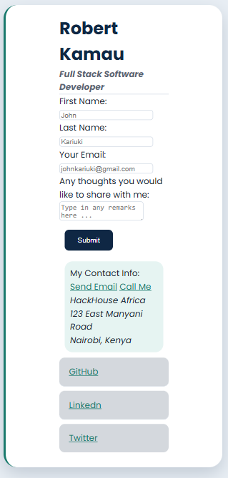
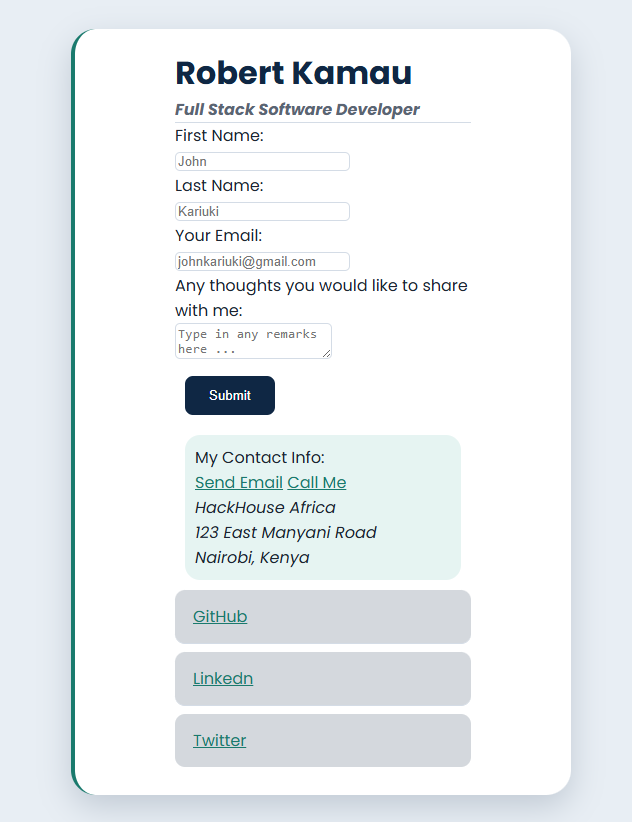
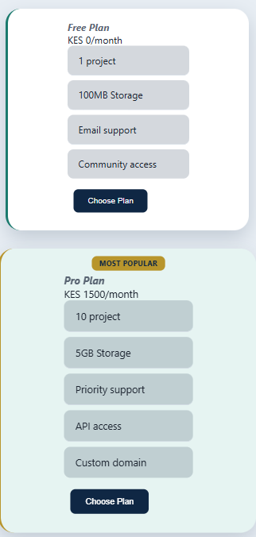
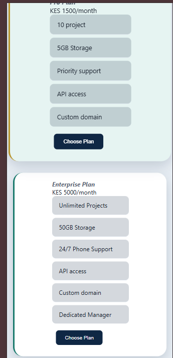
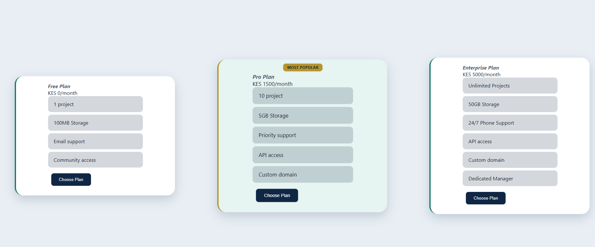

# week-1-day-2-assignment

## This is the second assignment at Mctaba Labs

- This is the link to the deployed version of my code on GitHub Pages.

- To setup this project on your computer you need to:
    + Clone the Project.
    + Start the html files in your terminal.
    + The Project runs successfully.

- This is the output of the Business Card Page: 
- Mobile View

- Desktop View

- This is the output of the Pricing Page:
- Mobile View

- Desktop View
